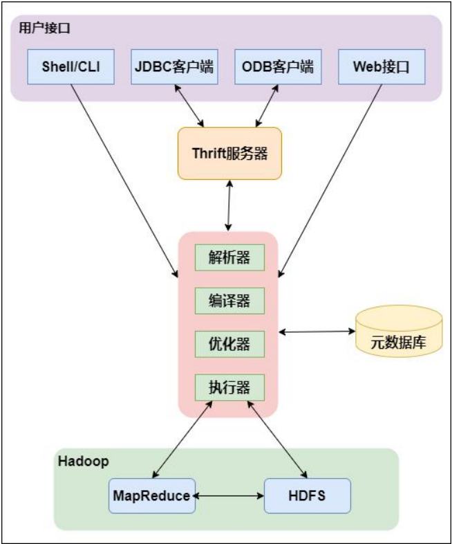

# Hive

Hive 是建立在[Hadoop](https：//hadoop.apache.org/) 上的数据仓库基础构架，可以将结构化的数据文件映射成一张数据表，实现了对大量数据的轻度汇总、查询和分析功能。Hive 定义了简单的类SQL 查询语言，简称为HQL，用户可以使用HQL进行数据读写以及计算。同时，HQL可以集成自己的功能来进行自定义分析，例如 User Defined Functions (UDF)。  

### Hive的架构



**用户连接接口**：Shell/CLI是指Shell命令，JDBC/ODBC是指Hive的java实现，Web接口是指可通过浏览器访问Hive

**Thrift Server**：Hive的可选组件，是一个软件框架服务，允许客户端使用多种编程语言通过编程方式远程访问Hive

**元数据**：Hive将元数据存储在如MySQL、Derby等数据库中。Hive的元数据包括表名、表所属的数据库名、表的拥有者、列与分区字段信息、表类型、表数据所在的路径等

**驱动器(Driver)**：驱动器包含解析器(SQLParser)、编译器(Compiler)、优化器(Optimizer)、执行器(Executer)。完成HQL查询语句从语法解析、语法分析、语法编译、语法优化以及查询计划的生成。生成的查询计划存储在HDFS上，之后提交给Hadoop的YARN，随后调用MapReduce执行

### 本地模式安装

安装Hive之前先安装Hadoop、Java和MySQL(使用MySQL保存元数据)，在Hive官网[下载](http：//archive.apache.org/dist/hive/)需要的Hive安装包

上传安装包到服务器，此处选择安装到/usr/local下，将安装包解压到指定目录

~~~shell
tar -zvxf apache-hive-2.1.1-bin.tar.gz -C /usr/local
~~~

进去安装目录修改安装文件名

~~~shell
cd /usr/local
mv apache-hive-2.1.1-bin hive
~~~

进入/etc/profile文件配置Hive环境变量

~~~shell
vi /etc/profile
# 添加如下内容
export HIVE_HOME=/usr/local/hive
export PATH=$HIVE_HOME/bin:$PATH
~~~

让profile文件生效

~~~shell
source /etc/profile
~~~

配置hive-env.sh：进入hive目录下的conf目录，复制出一个hive-env.sh文件

~~~shell
cd hive/conf
cp hive-env.sh.template hive-env.sh
~~~

~~~shell
vi hive-env.sh
# 添加如下内容，此处JAVA_HOME和HADOOP_HOME根据自己安装的路径配置
export HIVE_CONF_DIR=/usr/local/hive/conf
export JAVA_HOME=/usr/local/jdk
export HADOOP_HOME=/usr/local/hadoop
export HIVE_AUX_JARS_PATH=/usr/local/hive/lib
~~~

配置hive-site.xml：在hive/conf目录下复制出一个hive-site.xml文件。把hive-site.xml 中所有包含`${system：java.io.tmpdir}`替换成`/usr/local/hive/iotmp.`，如果系统默认没有指定系统用户名,那么要把配置`${system：user.name}`替换成当前用户名`root`，并且修改如下的四个配置。

> 需要降低MySQL密码策略机制，改为low。hive的元数据在mysql库里创建的数据库hive的编码最好设置成latin1

~~~shell
cp hive-default.xml.template hive-site.xml
vi hive-site.xml
~~~

~~~xml
<!--配置mysql的连接字符串-->
<property>
<name>javax.jdo.option.ConnectionURL</name>
<value>jdbc:mysql://master:3306/hive?createDatabaseIfNotExist=true</value>
<description>JDBC connect string for a JDBC metastore</description>
</property>
<!--配置mysql的连接驱动-->
<property>
<name>javax.jdo.option.ConnectionDriverName</name>
<value>com.mysql.jdbc.Driver</value>
<description>Driver class name for a JDBC metastore</description>
</property>
<!--配置登录mysql的用户-->
<property>
<name>javax.jdo.option.ConnectionUserName</name>
<value>root</value>
<description>username to use against metastore database</description>
</property>
<!--配置登录mysql的密码-->
<property>
<name>javax.jdo.option.ConnectionPassword</name>
<value>123456</value>
<description>password to use against metastore database</description>
</property>
~~~

配置好hive-site.xml后，需要下载上传MySQL的驱动包`mysql-connector-java-5.7.23-bin.jar`到/usr/local/hive/lib下，随后启动HDFS和YARN

~~~shell
start-dfs.sh
start-yarn.sh
~~~

初始化数据库

~~~shell
schematool -initSchema -dbType mysql
~~~

启动Hive

~~~sh
hive
~~~

### 数据类型与存储格式

##### 数据类型

`BOOLEAN`：true/false  								 	`TINYINT`：1字节的有符号整数，表示范围： -128~127

`STRING`：字符串										   	`SMALLINT`：2个字节的有符号整数，表示范围： -32768~32767

`VARCHAR`：变长字符串									`INT`：4个字节的带符号整数，表示范围： -2147483648~2147483647

`CHAR`：固定长度字符串					         	`BIGINT`：8字节带符号整数，表示范围： -2^64~2^64-1

`BINARY`：字节数组									    	`FLOAT`：4字节单精度浮点数

`TIMESTAMP` ：时间戳								 		`DOUBLE`：8字节双精度浮点数

`DATE`：日期									 		          	`DEICIMAL`：任意精度的带符号小数

`ARRAY`：数组类型									       	`MAP`：key-value，key必须为原始类型，value可以任意类型

`STRUCT`：段集合，类型可以不同

##### 存储格式

**textfile**：，行式存储，纯文本文件存储格式，不压缩，也是hive的默认存储格式，磁盘开销大，数据解析开销大

**sequencefile**：二进制行式存储，会压缩，不能使用load方式加载数据

**parquet**：二进制列式存储，会压缩，不能使用load方式加载数据

**orc**：二进制列式存储，会压缩，不能load。查询性能高

##### 常用压缩格式

| 压缩    | 压缩比 | 压缩速度 | 需要安装 | 编码器                                     | 是否可切分       |
| ------- | ------ | -------- | -------- | ------------------------------------------ | ---------------- |
| DEFAULT | 无     | 无       | 否       | org.apache.hadoop.io.compress.DefaultCodec | 否               |
| Gzip    | 很高   | 比较快   | 否       | org.apache.hadoop.io.compress.GzipCodec    | 否               |
| bzip2   | 最高   | 慢       | 否       | org.apache.hadoop.io.compress.BZip2Codec   | 是               |
| LZO     | 比较高 | 很快     | 是       | com.hadoop.compression.lzo.LzopCodec       | 是(需要建立索引) |
| Snappy  | 比较高 | 很快     | 是       | org.apache.hadoop.io.compress.SnappyCodec  | 否               |

### 表类型

**内部表**：表目录会创建在`hive-site.xml`中的`{hive.metastore.warehouse.dir}`目录下，数据也会存储到该目录下，删除内部表后数据也同样删除，默认创建的表就是内部表

**外部表**：外部表需要使用关键字`external`，外部表会根据创建表时`LOCATION`指定的路径来创建目录，删除外部表后，表对应的数据不会被删除

**分区表**：Hive在做数据查询时，会扫描整个表内容，随着数据量的加大，全表扫描会消耗更多的时间，而某些情况业务只需要查询某些特定的数据，所以Hive在建表的时候引入了partiiton的概念。即在建表时，将整个表存储在不同的子目录中，每一个子目录对应一个分区，在查询时，可以指定分区查询，避免全表扫描，从而提高查询效率

**分桶表**：桶表就是对指定列进行哈希(hash)计算，然后会根据 hash 值进行切分数据，将具有不同 hash 值的数据写到每个桶对应的文件中。Hive分桶的原理与MapReduce中的HashPartitioner的原理一模一样，使用分桶字段的hash值对分桶的数量进行取模(取余)。针对某一列进行分桶存储。每一条记录都是通过分桶字段的值的hash对分桶个数取余，然后确定放入哪个桶

### Hive函数

##### 一、关系运算

1. 等值比较： **`=`**           2. 不等值比较：**`<>`**              3. 小于比较： `<`                        4. 小于等于比较：**`<=`**

5. 大于比较：**`>`**           6. 大于等于比较：**`>=`**           7. 空值判断：**`IS NULL`**           8. 非空判断：**`IS NOT NULL`**

9. LIKE比较：**`LIKE`**              10. JAVA的LIKE操作： **`RLIKE`**              11. REGEXP操作：**`REGEXP`**

##### 二、数学运算

1. 加法操作： **`+`**                 2. 减法操作： **`-`**                        3. 乘法操作： **`*`**                       4. 除法操作： **`/`**

5. 取余操作： **`%`**               6. 位与操作： **`&`**                       7. 位或操作： **`|`**                        8. 位异或操作： **`^`**

9. 位取反操作： **`~`**

##### 三、逻辑运算

1. 逻辑与操作： **`AND` **                2. 逻辑或操作：**`OR`**                3. 逻辑非操作： **`NOT`**

##### 四、数值计算

1. 取整函数： **`round`**                      2. 指定精度取整函数： **`round`**                3. 向下取整函数： **`floor`**

4. 向上取整函数： **`ceil`**                5. 向上取整函数： **`ceiling`**                    6. 取随机数函数： **`rand`**

7. 自然指数函数： **`exp`**                  8. 以10为底对数函数： **`log10`**                 9. 以2为底对数函数： **`log2`**

10. 对数函数： **`log`**                          11. 幂运算函数： **`pow`**                              12. 幂运算函数： **`power`**

13. 开平方函数： **`sqrt`**                    14. 二进制函数： **`bin`**                              15. 十六进制函数： **`hex`**

16. 反转十六进制函数： **`unhex`**      17. 进制转换函数： **`conv`**                        18. 绝对值函数： **`abs`**

19. 正取余函数： **`pmod`**                    20. 正弦函数： **`sin`**                                  21. 反正弦函数： **`asin`**

22. 余弦函数： **`cos`**                          23. 反余弦函数： **`acos`**                            24. positive函数： **`positive`**

25. negative函数： **`negative`**

##### 五、日期函数

1. UNIX时间戳转日期函数： **`from_unixtime`**              2. 获取当前UNIX时间戳函数： **`unix_timestamp`**

3. 日期转UNIX时间戳函数： **`unix_timestamp`**            4. 指定格式日期转UNIX时间戳函数： **`unix_timestamp`**

5. 日期时间转日期函数： **`to_date`**                                6. 日期转年函数： **`year`**

7. 日期转月函数： **`month`**                                                8. 日期转天函数： **`day`**

9. 日期转小时函数： **`hour`**                                              10. 日期转分钟函数： **`minute`**

11. 日期转秒函数： **`second`**                                              12. 日期转周函数： **`weekofyear`**

13. 日期比较函数： **`datediff`**                                          14. 日期增加函数： **`date_add`**

15. 日期减少函数： **`date_sub`**

##### 六、条件函数

1. If函数： **`if`**                                  2. 非空查找函数： **`COALESCE`**                                  3. 条件判断函数：**`CASE`**

##### 七、字符串函数

1. 长度：**`length`**                                  2. 反转：**`reverse`**                                  3. 连接：**`concat`**

4. 带分隔符连接：**`concat_ws`**           5. 截取：**`substr,substring`**                   6. 转大写：**`upper,ucase`**

7. 转小写：**`lower,lcase`**                      8. 去空格：**`trim`**                                    9. 左边去空格：**`ltrim`**

10. 右边去空格：**`rtrim`**                        11. 正则表达式替换：**`regexp_replace`**

12. 正则表达式解析：**`regexp_extract`**                                                               13. URL解析：**`parse_url`**

14. json解析：**`get_json_object`**           15. 空格字符串：**`space`**                       16. 重复字符串：**`repeat`**

17. 首字符ascii：**`ascii`**                          18. 左补足：**`lpad`**                                  19. 右补足：**`rpad`**

20. 分割字符串： **`split`**                         21. 集合查找： **`find_in_set`**

##### 八、集合统计函数

1. 个数统计函数： **`count`**                  2. 总和统计函数： **`sum`**                     3. 平均值统计函数： **`avg`**

4. 最小值统计函数： **`min`**                 5. 最大值统计函数： **`max`**                  6. 非空集合总体变量函数： **`var_pop`**

7. 非空集合样本变量函数： **`var_samp`**                                                           8. 总体标准偏离函数： **`stddev_pop`**

9. 样本标准偏离函数： **`stddev_samp`**                                                           10．中位数函数： **`percentile`**

11. 中位数函数： **`percentile`**                                                            12. 近似中位数函数： **`percentile_approx`**

13. 近似中位数函数： **`percentile_approx`**                                     14. 直方图： **`histogram_numeric`**

##### 九、复杂类型访问操作

1. array类型访问： `A[n]`                         2. map类型访问： `M[key]`                         3. struct类型访问： `S.x`

##### 十、复杂类型长度统计函数

1. Map类型长度函数： `size(Map)`         2. array类型长度函数： `size(Array)`         3. 类型转换函数：`cast`

### 数据库操作

查看数据库

~~~sql
SHOW DATABASES;
~~~

使用数据库

~~~sql
USE databasesname;
~~~

创建数据库

~~~sql
-- 创建的数据库位于hive配置文件指定路径下
CREATE DATABASE IF NOT EXISTS databasesname;

-- 创建数据库并指定位置
CREATE DATABASE databasesname location '/user/myhive';
~~~

查看数据库描述信息

~~~sql
-- 查看数据库描述信息
DESC DATABASE databasename;

-- 查看数据库更多描述信息
DESC DATABASE EXTENDED databasename;
~~~

修改数据库

~~~sql
ALTER DATABASE databasename SET dbpropertits('createtime'='20211212');
~~~

删除数据库

~~~sql
DROP DATABASE databasename;
~~~

### 数据表操作

创建表

~~~sql
-- 创建分区表
create table if not exists tablename(
    uid String comment '用户id',
    page String comment '页面',
    load_dt String comment '时间',
    active_duration int comment '时长'
) comment '用户流览表'
partition by (String inc_day)
row format delimited fields terminated by '\001'
stroed as orc tblproperties('orc.compress'='SNAPPY');

-- 创建外部表
create external table if not exists tablename(
    uid String comment 'uuid',
    info Map<String, String> comment '信息'
)
row format delimited fields terminated by '\001'
map keys terminated by ':'
location 'user/myhive/user_info';
~~~

查看所有表

~~~sql
show tables;

-- 模糊查询表
show tables like "ods";
~~~

查看表信息

~~~sql
-- 查看表结构信息
desc tablename;

-- 查看详细表结构信息
desc formatted tablename;

-- 查看更详细表结构信息
desc extended tablename;
~~~

查看表的创建语句

~~~sql
show create table tablename;
~~~

查看表分区

~~~sql
show partitions tablename;
~~~

修改表信息

~~~sql
alter table tablename set tblproperties('parquet.compress'='LZO');
~~~

加载数据，只能是textfile类型的表才可以

~~~sql
load data [local] inpath '/root/data/test.txt' [overwrite] into table tablename [partition];
~~~

### hive小文件处理

1、使用 hive 自带的 concatenate 命令，自动合并小文件，可以执行多次，该命令只支持RCFILE和ORC类型的表

```sql
-- 非分区表
alter table tablename concatenate;

-- 分区表
alter table tablename partition(inc_day='20211224') concatenate;
```

2、调整参数减少Map数量

- 设置map输入合并小文件的相关参数

  ~~~sql
  -- 执行Map前进行小文件合并，CombineHiveInputFormat底层是 Hadoop的 CombineFileInputFormat 方法，此方法是在mapper中将多个文件合成一个split作为输入
  set hive.input.format=org.apache.hadoop.hive.ql.io.CombineHiveInputFormat; -- 默认
  
  -- 每个Map最大输入大小(这个值决定了合并后文件的数量)
  set mapred.max.split.size=256000000;   -- 256M
  
  -- 一个节点上split的至少的大小(这个值决定了多个DataNode上的文件是否需要合并)
  set mapred.min.split.size.per.node=100000000;  -- 100M
  
  -- 一个交换机下split的至少的大小(这个值决定了多个交换机上的文件是否需要合并)
  set mapred.min.split.size.per.rack=100000000;  -- 100M
  ~~~

- 设置map输出和reduce输出进行合并的相关参数

  ~~~sql
  -- 设置map端输出进行合并，默认为true
  set hive.merge.mapfiles = true;
  
  -- 设置reduce端输出进行合并，默认为false
  set hive.merge.mapredfiles = true;
  
  -- 设置合并文件的大小
  set hive.merge.size.per.task = 256*1000*1000;   -- 256M
  
  -- 当输出文件的平均大小小于该值时，启动一个独立的MapReduce任务进行文件merge
  set hive.merge.smallfiles.avgsize=16000000;   -- 16M 
  ~~~

- 启用压缩

  ~~~sql
  -- hive的查询结果输出是否进行压缩
  set hive.exec.compress.output=true;
  
  -- MapReduce Job的结果输出是否使用压缩
  set mapreduce.output.fileoutputformat.compress=true;
  ~~~

3、减少Reduce的数量

~~~sql
-- reduce 的个数决定了输出的文件的个数，所以可以调整reduce的个数控制hive表的文件数量，hive中的分区函数 distribute by 正好是控制MR中partition分区的，然后通过设置reduce的数量，结合分区函数让数据均衡的进入每个reduce即可。

-- 设置reduce的数量有两种方式，第一种是直接设置reduce个数
set mapreduce.job.reduces=10;

-- 第二种是设置每个reduce的大小，Hive会根据数据总大小猜测确定一个reduce个数
set hive.exec.reducers.bytes.per.reducer=5120000000; -- 默认是1G，设置为5G

-- 执行以下语句，将数据均衡的分配到reduce中
set mapreduce.job.reduces=10;
insert overwrite table A partition(dt)
select * from B
distribute by rand();

-- 解释：如设置reduce数量为10，则使用 rand()， 随机生成一个数 x % 10 ，这样数据就会随机进入 reduce 中，防止出现有的文件过大或过小
~~~

4、使用hadoop的archive将小文件归档

Hadoop Archive简称HAR，是一个高效地将小文件放入HDFS块中的文件存档工具，它能够将多个小文件打包成一个HAR文件，这样在减少namenode内存使用的同时，仍然允许对文件进行透明的访问

```sql
-- 用来控制归档是否可用
set hive.archive.enabled=true;

-- 通知Hive在创建归档时是否可以设置父目录
set hive.archive.har.parentdir.settable=true;

-- 控制需要归档文件的大小
set har.partfile.size=1099511627776;

-- 使用以下命令进行归档
ALTER TABLE A ARCHIVE PARTITION(dt='2020-12-24', hr='12');

-- 对已归档的分区恢复为原文件
ALTER TABLE A UNARCHIVE PARTITION(dt='2020-12-24', hr='12');
```

> 注意:  归档的分区可以查看不能 insert overwrite，必须先 unarchive

5、如果是因为插入引起的小文件，可以重查询插入

~~~sql
insert overwite table tablename select * from tablename;
~~~


